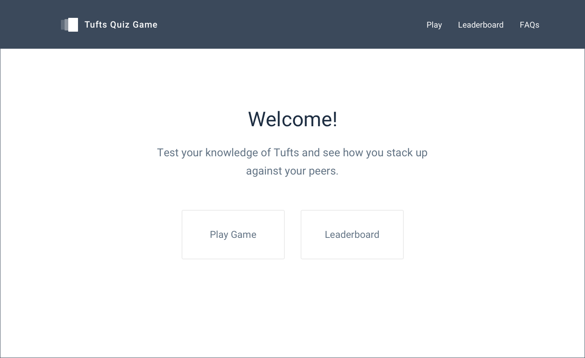
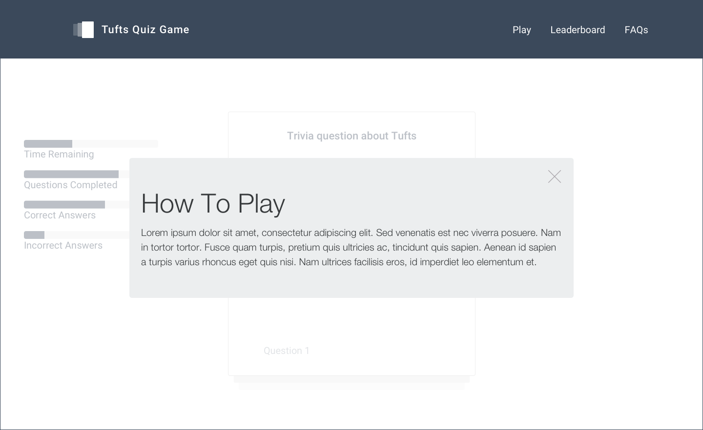
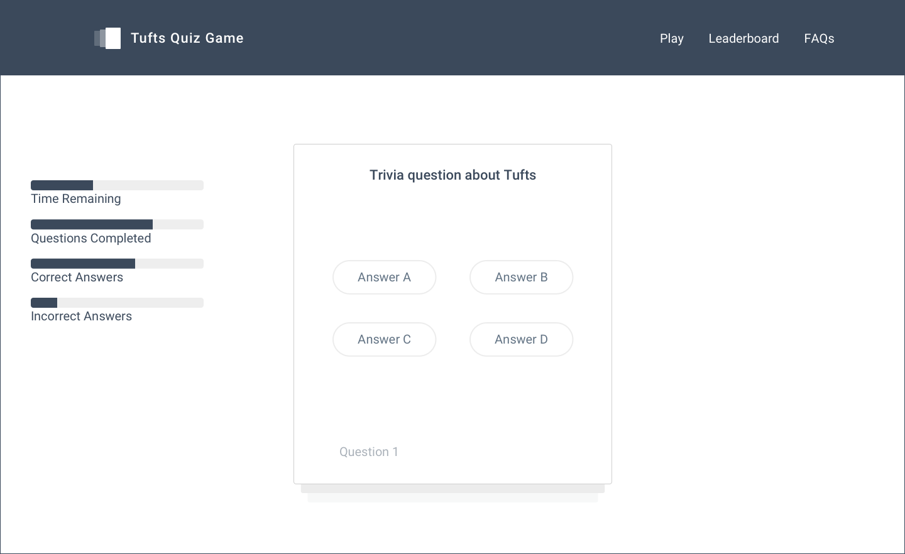
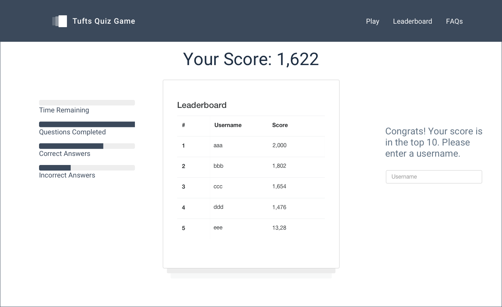

##Tufts Quiz Game##

###Team Members ###

* Selena Groh, Jillian Howarth, Ben Machlin, Caroline Sheng, Craig Vitirinyu

###Problem statement###

* There is not a Tufts specific space for students to test their knowledge of the school. 

###Solution###

* We plan to solve this problem by making a Tufts trivia game where Tufts students can test their knowledge of all things Tufts (history, sports, geography, and see how they rank among their peers.

###Use Scenario###

* When the user first visits our game, they are are presented with a screen explaining how the game works and they are given the option to play the game or view the leaderboard. Once a user decides to start playing the game, they will be given timed multiple choice questions(10-15 seconds per question) about Tufts Trivia. 

* As they answer the questions, they will gain points for each correct answer. Their total score will be displayed as well as the game progresses. After they answer a question, they will immediately move on to the next question. 

* After they finish answering all the questions, they will be shown their total score and the high scores leaderboard.  If their score is high enough, they are given the option to input a name to accompany their score on the leaderboard. 

###Features (Pick Three)###

* Front-end framework including Bootstrap, React, Backbone.js, AngularJS)
 * We will use Bootstrap for the interface design
* Server-side data persistence (e.g., with PostgreSQL, MongoDB, MySQL)
 * Question data, leaderboard scores and usernames will be stored on a server and retrieved upon completion of the game.
* Reporting with charts and graphs
 * The leaderboard information will be displayed as a chart, showing the top players and personal rank in comparison.

###Data###

* A collection of 50-100 trivia questions and their corresponding answers will be stored on a server 

* The high scores and the name players provide (if they decide to) will be stored

* As the user plays, their current score (and the questions they got right and wrong) will be stored locally, but their high score will only be stored on the server if it ranks high enough

###Algorithms###

* A randomization algorithm to randomize the selection of questions, but ensure questions are not repeated

* A sorting algorithm to correctly rank the order of the leaderboard

###Mock-Ups###

#Comments By Ming
* I think you have sold me into the idea of user scenario for future proposals
* This idea is okay but will not score high on originality.  I bet you will find it difficult to build a collection of questions about Tufts.
