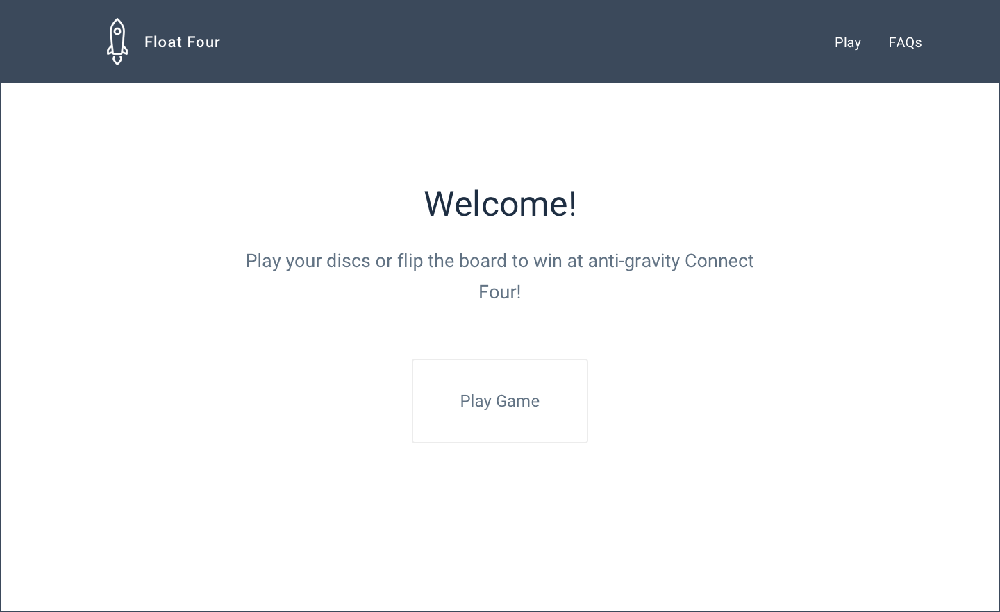
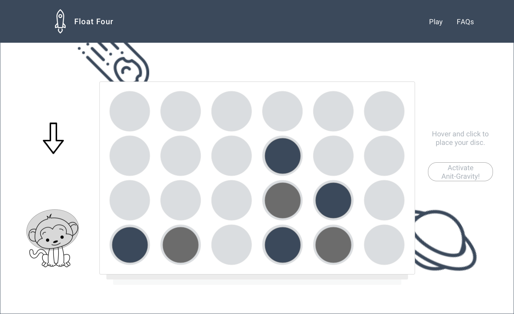
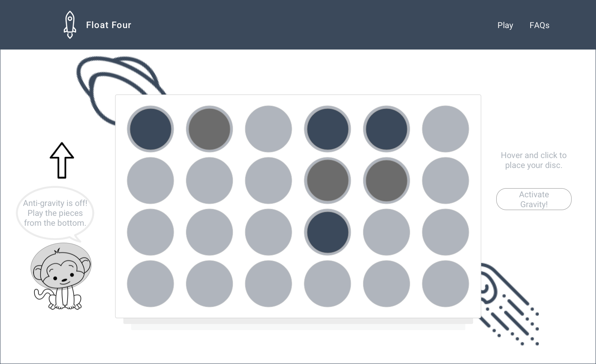

# Float Four
*a game by Selena Groh, Jillian Howarth, Ben Machlin, Caroline Sheng, and Craig Vitirinyu*

Float Four is adds a new dimension of strategy to the classic game Connect Four. Players can, at their will, reverse the direction of gravity, causing the pieces to float to the top of the board and therefore altering the relationships between them.

## Use Scenario
###### Basics
When 2 users begin playing, they are playing Float Four the way they would play Connect Four, by adding colored pieces one at a time to the gameboard from the top. Each piece goes in one of seven columns, chosen by the player.
###### Gravity Reversal
When the gravity is reversed, pieces are added at the bottom and they float up to rest against the top pieces. On each user’s turn, they can either place a piece in the board or reverse gravity, disrupting the carefully laid plans of their opponent.
###### Winning
The game ends when one user obtains 4 same-colored discs in a row horizontally, vertically, or diagonally. If both users obtain a win at the same time, the game ends in a tie. If the board fills up with pieces without a win, the game is over with no winners.

## Features
###### Front-end framework (Bootstrap)
We used Bootstrap for the interface design.

###### Server-side data persistence (MongoDB)
We used MongoDB to store statistics on how many wins there are for each color across games. This information is useful in determining if player one or player two has a disproportionate advantage.

###### Charts and Graphs
We used the [Google Charts API](https://developers.google.com/chart/) to graphically represent the data stored in MongoDB on our stats.html page.
###### Use of a JavaScript framework for games (canva.js)
We used canva.js to create the visuals of our game including the gameboard and game pieces.

## Algorithms
We implemented an algorithm to change the location of the discs when a user reverses the direction of gravity and an algorithm to check if a player has won the game (by placing four same-colored discs in a row horizontally, vertically, or diagonally).

## Mock-Ups

